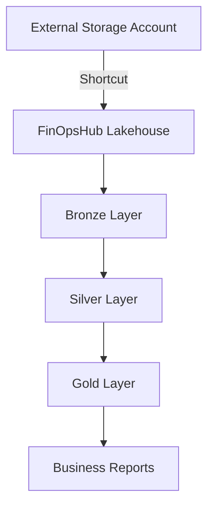

# FinOpsHub Lakehouse Shortcuts Configuration

## Overview

This document describes the OneLake shortcuts configured for the FinOpsHub lakehouse, which provide direct access to external data sources without data duplication. Shortcuts enable seamless integration with external storage accounts and data sources.

## Shortcuts Definition

### 📊 **Table Shortcuts** (`/Tables` path)

#### 1. **costexport**
- **Purpose**: Primary cost export data from Azure Cost Management
- **Location**: `/costexport` in the external storage account
- **Data Type**: Azure Cost Management exports (CSV/Parquet)
- **Update Frequency**: Daily
- **Usage**: Direct source for Bronze layer cost data ingestion

```sql
-- Access cost export data directly via shortcut
SELECT * FROM FinOpsHub.costexport
WHERE Date >= '2024-01-01'
LIMIT 1000;
```

#### 2. **azure_billing_exports**
- **Purpose**: Detailed Azure billing data exports
- **Location**: `/billing/azure` in the external storage account  
- **Data Type**: Enterprise Agreement billing details
- **Update Frequency**: Monthly
- **Usage**: Detailed billing analysis and reconciliation

#### 3. **aws_cost_reports**
- **Purpose**: AWS Cost and Usage Reports (CUR)
- **Location**: `/billing/aws` in the external storage account
- **Data Type**: AWS CUR files (Gzipped CSV/Parquet)
- **Update Frequency**: Daily
- **Usage**: Multi-cloud cost analysis and comparison

#### 4. **resource_inventory**  
- **Purpose**: Cloud resource metadata and configuration
- **Location**: `/inventory` in the external storage account
- **Data Type**: Resource tags, configurations, and metadata
- **Update Frequency**: Real-time/Hourly
- **Usage**: Resource enrichment and cost allocation

#### 5. **budget_allocations**
- **Purpose**: Budget planning and allocation data
- **Location**: `/budgets` in the external storage account
- **Data Type**: Budget plans, forecasts, and allocations
- **Update Frequency**: Monthly/Quarterly
- **Usage**: Budget vs. actual variance analysis

### 📁 **File Shortcuts** (`/Files` path)

#### 6. **external_data_sources**
- **Purpose**: External vendor data and supplementary files
- **Location**: `/external` in the external storage account
- **Data Type**: Vendor invoices, contracts, market data
- **Update Frequency**: As needed
- **Usage**: Manual uploads and external data integration

#### 7. **archived_reports**
- **Purpose**: Historical reports and audit data
- **Location**: `/archives` in the external storage account
- **Data Type**: PDF reports, audit files, compliance documentation
- **Update Frequency**: Monthly/Quarterly
- **Usage**: Historical analysis and compliance reporting

## Connection Details

### Storage Account Configuration
- **Storage Account**: `2trickcostexport.dfs.core.windows.net`
- **Connection ID**: `ac9d047e-1e22-404f-ab2c-3a3a71e90273`
- **Protocol**: Azure Data Lake Storage Gen2 (ADLSv2)
- **Authentication**: Managed Identity or Service Principal

### Security and Access Control

```json
{
  "connection_type": "AdlsGen2",
  "authentication": {
    "type": "managed_identity",
    "scope": "https://storage.azure.com/"
  },
  "permissions": {
    "read": "all_shortcuts",
    "write": "none",
    "list": "all_shortcuts"
  }
}
```

## Usage Patterns

### 1. **Direct Query Access**
Query external data directly through shortcuts without data movement:

```python
# Read cost export data directly via shortcut
cost_data = spark.read.format("delta").table("FinOpsHub.costexport")

# Filter and process without copying data
recent_costs = cost_data.filter(col("Date") >= "2024-10-01")
```

### 2. **Bronze Layer Ingestion**
Use shortcuts as sources for Bronze layer data ingestion:

```python
def ingest_cost_data_to_bronze():
    # Read from shortcut
    source_data = spark.read.table("FinOpsHub.costexport")
    
    # Add ingestion metadata
    bronze_data = (source_data
        .withColumn("ingestion_timestamp", current_timestamp())
        .withColumn("source_system", lit("Azure Cost Management"))
        .withColumn("ingestion_batch_id", lit(f"batch_{datetime.now().strftime('%Y%m%d_%H%M%S')}"))
    )
    
    # Write to Bronze layer
    (bronze_data.write
        .mode("append") 
        .option("mergeSchema", "true")
        .saveAsTable("FinOpsHub.bronze.raw_cost_data"))
```

### 3. **Multi-Source Data Integration**
Combine data from multiple shortcuts for comprehensive analysis:

```python
# Combine Azure and AWS cost data
azure_costs = spark.read.table("FinOpsHub.azure_billing_exports")
aws_costs = spark.read.table("FinOpsHub.aws_cost_reports")

# Standardize schema and union
unified_costs = (
    azure_costs.select("date", "service", "cost", lit("Azure").alias("cloud_provider"))
    .union(
        aws_costs.select("usage_date", "service_name", "unblended_cost", lit("AWS").alias("cloud_provider"))
    )
)
```

## Data Governance and Compliance

### Access Control
- **Read-Only**: All shortcuts are configured as read-only to prevent accidental data modification
- **Audit Trail**: All access through shortcuts is logged and auditable
- **Workspace Isolation**: Shortcuts are scoped to the FinOpsHub lakehouse workspace

### Data Lineage


### Compliance Considerations
- **Data Sovereignty**: Data remains in original location (no cross-border movement)
- **Retention**: Follows external storage account retention policies
- **Encryption**: Inherits encryption settings from source storage account
- **Access Logs**: Combined logging from both lakehouse and storage account

## Performance Optimization

### Query Optimization
```sql
-- Optimize queries by leveraging storage account partitioning
SELECT 
    cloud_provider,
    service_category,
    SUM(cost_amount) as total_cost
FROM (
    -- Use partition elimination on shortcuts
    SELECT * FROM FinOpsHub.costexport WHERE year = 2024 AND month = 10
    UNION ALL
    SELECT * FROM FinOpsHub.aws_cost_reports WHERE billing_year = 2024 AND billing_month = 10
)
GROUP BY cloud_provider, service_category;
```

### Caching Strategy
```python
# Cache frequently accessed shortcut data
cost_export_cached = spark.read.table("FinOpsHub.costexport").cache()
cost_export_cached.createOrReplaceTempView("cached_cost_export")

# Use cached view for multiple operations
monthly_summary = spark.sql("""
    SELECT year, month, SUM(cost) as total_cost 
    FROM cached_cost_export 
    GROUP BY year, month
""")
```

## Monitoring and Alerting

### Data Freshness Monitoring
```python
def check_shortcut_data_freshness():
    shortcuts_status = {}
    
    for shortcut in ["costexport", "azure_billing_exports", "aws_cost_reports"]:
        latest_data = spark.sql(f"""
            SELECT MAX(Date) as latest_date 
            FROM FinOpsHub.{shortcut}
        """).collect()[0]['latest_date']
        
        days_old = (datetime.now().date() - latest_data).days
        shortcuts_status[shortcut] = {
            "latest_date": latest_data,
            "days_old": days_old,
            "status": "STALE" if days_old > 2 else "FRESH"
        }
    
    return shortcuts_status
```

### Performance Monitoring
```sql
-- Monitor shortcut query performance
SELECT 
    query_text,
    execution_time_ms,
    data_scanned_gb,
    shortcut_name
FROM system.query_history 
WHERE query_text LIKE '%FinOpsHub.costexport%'
    AND execution_date >= CURRENT_DATE() - INTERVAL 7 DAYS
ORDER BY execution_time_ms DESC;
```

## Troubleshooting

### Common Issues and Solutions

#### 1. **Connection Failures**
```bash
# Check connection status
az storage account show --name 2trickcostexport --query "primaryEndpoints.dfs"

# Verify managed identity permissions
az role assignment list --assignee <managed-identity-id> --scope /subscriptions/<sub-id>/resourceGroups/<rg>/providers/Microsoft.Storage/storageAccounts/2trickcostexport
```

#### 2. **Data Access Issues**
```python
# Test shortcut connectivity
try:
    test_query = spark.sql("SELECT COUNT(*) FROM FinOpsHub.costexport LIMIT 1")
    print("✅ Shortcut accessible")
except Exception as e:
    print(f"❌ Shortcut error: {e}")
```

#### 3. **Performance Issues**
- **Solution**: Use partition pruning and column selection
- **Monitor**: Query execution plans and data scan volumes
- **Optimize**: Consider materializing frequently accessed data to Delta tables

## Best Practices

### 1. **Query Design**
- Always use partition filtering when possible
- Select only required columns to minimize data transfer
- Use LIMIT clauses during development and testing

### 2. **Data Management**
- Regularly monitor shortcut data freshness
- Implement data quality checks on shortcut data
- Use shortcuts for read-only operations only

### 3. **Security**
- Regularly audit connection permissions
- Monitor access patterns for anomalies
- Keep connection credentials secure and rotated

---

**📝 Note**: Shortcuts provide a powerful way to access external data without duplication while maintaining data governance and security controls.